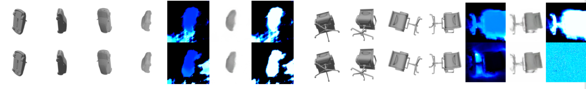

# 3D Augmentation with PixelNeRF


## Teammate
* Zhi-Yi Chin: joycenerd.cs09@nycu.edu.tw
* Chieh-Ming Jiang: nax1016.cs10@nycu.edu.tw

## Introduction
Using PixelNeRF as 3D point cloud augmentation.

## Getting the code
You can download a copy of all the files in this repository by cloning this repository:
```
git clone https://github.com/joycenerd/3Daug_pixel-nerf.git
```

## Requirements
You need to have [Anaconda](https:www.anaconda.com/) or Miniconda already installed in your environment. To install requirements:
```
cd pixel-nerf
conda env create -f environment.yml
```

## Data

### Download raw data
* [ModelNet](https://modelnet.cs.princeton.edu/)
* [ShapeNet](https://shapenet.org/)

### Data conversion
#### A. convert `.off` to `.obj`
    Please check **`model-converter-python`** in [3D_Augmentation](https://github.com/joycenerd/3D_Augmentation) repo
    
    ```
    cd model-converter-python
    python convert.py \
    --data-root <data_dir> \
    --output-root <save_dir>
    ```
#### B. Render 20 views (rgb, poses) -> **SRN input format**

    Please refer to [here](shapenet_renderer/README.md) for detail.
#### C. Render 20 views (rgb, transformation matrix) -> **multi-obj input format**
1. Install Blender
    ```
    wget https://mirror.clarkson.edu/blender/release/Blender2.90/blender-2.90.1-linux64.tar.xz
    tar -xvf blender-2.90-linux64.tar.xz 
    ```
2. Install python dependencies
    ```
    cd $INSTALL_PATH/blender-2.82a-linux64/2.82/python/bin/
    ./python3.7m -m ensurepip
    ./pip3 install numpy scipy
    ./pip3 install dotmap
    ```
3. Run [`render_shapenet.py`](pixel-nerf/scripts/render_shapenet.py)
    ```
    blender --background -noaudio --python render_shapenet.py -- --object chair --src_model_dir <obj_data_dir> --out_dir <save_dir> --val_frac 0.3 --test_frac 0.0 --split <train/val/test> --n_objects 1
    ```

## SRN data

### Training
```
python train/train.py -n srn_car_exp -c conf/exp/srn.conf -D <data_dir> --gpu_id '0 1' --dataset_format srn --save_dir <save_dir> -B 2 -V 3
```

### Evaluate/Test
```
python eval/eval.py -D <data_dir> --split test --output <save_dir_from_train> --write_depth --save_dir <save_dir> -n srn_chair_exp -P '22 25 28' --gpu_id 4
```

## Multi object data

### Training
```
python train/train.py -n multi_obj_chair_exp_test -c conf/exp/multi_obj.conf -D <data_dir>  --gpu_id=5 --save_dir <save_dir> --dataset_format multi_obj -V 10
```

### Evaluate/Test
```
python eval/eval.py -D <data_dir> -n multi_obj_chair_exp -P "5 7 10" --multicat -O <save_dir_from_train> --split val --save_dir <save_dir> -c conf/exp/multi_obj.conf --gpu_id=7  --write_depth
```

## Results



## GitHub Acknowledge
We thank the authors of these repositories:
* [sxyu/pixel-nerf](https://github.com/sxyu/pixel-nerf)

## Contributing

If you'd like to contribute, or have any suggestions, you can contact us at [joycenerd.cs09@nycu.edu.tw](mailto:joycenerd.cs09@nycu.edu.tw) or open an issue on this GitHub repository.

All contributions welcome! All content in this repository is licensed under the MIT license.


